# Library for fixed point operations with alternative specialized math modules.

Template dedicated for RISC-V 32 IM. 

There are two math modules:
* taylormath which is based mostly on taylor series
* polyapprox which is based on cubic Hermite interpolator

## Usage

### Files

All library files can be found in `src/lib/`.
Just copy the files and include them. 
Additionally `taylormath` need to be linked with its `cpp` file.
 
The library works with C++:
* std-c++23
* std-c++20
* std-c++17
* std-c++11 if you are not going to use constexpr functionalities (they works but not everywhere)

### Fixedpoint

The fixedpoint template has the following prototype:
~~~
template<typename T, typename TC=typename make_fast_int<T>::type, unsigned frac_bits=sizeof(T)*4-1> class fixedpoint;
~~~

* `T` - integer type for calculations.
* `TC` - integer type for multiplication and division. By default it is `fast` type of the `T` (on 64-bits systems it is usually `int64` / `uint64`)
* `frac_bits` - number - where to put the fraction point.

There are predefinied types:

* Standard types (the fastest TC with at least T size)

    * signed

        * fixed8 - signed 8 bit `T`, fast 8 bit type for `TC`, 3 fraction bits
        * fixed16 - signed 16 bit `T`, fast 16 bit type for `TC`, 7 fraction bits
        * fixed32 - signed 32 bit `T`, fast 32 bit type for `TC`, 15 fraction bits
        * fixed64 - signed 64 bit `T`, fast 64 bit type for `TC`, 31 fraction bits

    * unsigned

        * ufixed8 - unsigned 8 bit `T`, fast 8 bit type for `TC`, 3 fraction bits
        * ufixed16 - unsigned 16 bit `T`, fast 16 bit type for `TC`, 7 fraction bits
        * ufixed32 - unsigned 32 bit `T`, fast 32 bit type for `TC`, 15 fraction bits
        * ufixed64 - unsigned 64 bit `T`, fast 64 bit type for `TC`, 31 fraction bits

* Accurate types (TC two times larger than T - except [u]int64)

    * signed

        * fixed8_a - signed 8 bit `T`, fast 16 bit type for `TC`, 3 fraction bits
        * fixed16_a - signed 16 bit `T`, fast 32 bit type for `TC`, 7 fraction bits
        * fixed32_a - signed 32 bit `T`, fast 64 bit type for `TC`, 15 fraction bits
        * *fixed64_a - signed 64 bit `T`, fast 64 bit type for `TC`, 31 fraction bits*

    * unsigned

        * ufixed8_a - unsigned 8 bit `T`, fast 16 bit type for `TC`, 3 fraction bits
        * ufixed16_a - unsigned 16 bit `T`, fast 32 bit type for `TC`, 7 fraction bits
        * ufixed32_a - unsigned 32 bit `T`, fast 64 bit type for `TC`, 15 fraction bits
        * *ufixed64_a - unsigned 64 bit `T`, fast 64 bit type for `TC`, 31 fraction bits*

* Simple types (same size of T and TC)

    * signed

        * fixed8_s - signed 8 bit `T`, 8 bit type for `TC`, 3 fraction bits
        * fixed16_s - signed 16 bit `T`, 16 bit type for `TC`, 7 fraction bits
        * fixed32_s - signed 32 bit `T`, 32 bit type for `TC`, 15 fraction bits
        * fixed64_s - signed 64 bit `T`, 64 bit type for `TC`, 31 fraction bits

    * unsigned

        * ufixed8_s - unsigned 8 bit `T`, 8 bit type for `TC`, 3 fraction bits
        * ufixed16_s - unsigned 16 bit `T`, 16 bit type for `TC`, 7 fraction bits
        * ufixed32_s - unsigned 32 bit `T`, 32 bit type for `TC`, 15 fraction bits
        * ufixed64_s - unsigned 64 bit `T`, 64 bit type for `TC`, 31 fraction bits

* Other types (based on `std::size_t`)

    * signed

        * fixed_t - signed `std::size_t` for `T`, fast signed `std::size_t` for `TC`, `sizeof(std::size_t) * 4 - 1` fraction bits;

    * unsigned

        * ufixed_t - unsigned `std::size_t` for `T`, fast unsigned `std::size_t` for `TC`, `sizeof(std::size_t) * 4 - 1` fraction bits;

#### Conversions from IEEE754

 Results of conversion from IEEE754 might be incorrect due to reading the numbers binary. 
 Always check results on the new target.
 In case of any errors use FIXED_POINT_IEEE754_ALWAYS_MULTIPLICATE macro.

### Taylormath

Each template takes a type which is used for calculations. 
It can be deduced by a compiler, but to avoid mistakes and calculating on too accuracy (and slower) type 
it is advised to fill the template parameter, f.e:
~~~~
std::cout << taylor::exp<fixed32_f>(x) << "\n";
std::cout << taylor::asin<fixed32_f>(x) << "\n";
std::cout << taylor::cos<fixed32_f>(x) << "\n";
std::cout << taylor::sqrt<fixed32_f>(x) << "\n";
~~~~

Taylormath calculates until increasing accuracy is not possible, so the more accurate type, the more time is needed to calculate a function result.

### Polyapprox

This is a class which allows to create an approximation (functional). 
There are required one template parameter (`Storable`) which will be used for parameters storage and calculating the value of the approximation. 
The constructor / `fit` method / `create` static function takes the following parameters:
* `src` - functional of a source function
* `part_count` - number of divisions of the source function on a given range
* `range_min` - minimal value of the range
* `range_max` - maximal value of the range
* `dx` - step for deriverates (default 1e-3)

The constructor, `fit` method and `create` static function are templates. 
The only parameter is a type which will be used for calculating parameters for the approximation.

## Test results

### Speed comparision (microseconds per 100000 operations on ESP32C3@160MHz)

<table><thead><tr><th>type</th><th>library</th><th>addition</th><th>subtraction</th><th>multiplication</th><th>division</th><th>sin</th><th>sqrt</th><th>asin</th><th>log</th><th>exp</th></tr></thead><tbody>
<tr><th>fixed32_s</th><th>taylormath</th><td>6986</td><td>6917</td><td>6918</td><td>38999</td><td>188329</td><td>78813</td><td>113823</td><td>343836</td><td>300288</td>

</tr>
<tr><th>fixed32_a</th><th>taylormath</th><td>6958</td><td>6923</td><td>15730</td><td>201259</td><td>306051</td><td>255731</td><td>171318</td><td>865932</td><td>387778</td>

</tr>
<tr><th>fixed64</th><th>taylormath</th><td>13252</td><td>13214</td><td>20762</td><td>206317</td><td>836684</td><td>384352</td><td>393059</td><td>1995360</td><td>1436721</td>

</tr>
<tr><th>fixed32_s</th><th>polyapprox</th><td>6962</td><td>6921</td><td>6921</td><td>38997</td><td>54698</td><td>27475</td><td>11103</td><td>38496</td><td>55431</td>

</tr>
<tr><th>fixed32_a</th><th>polyapprox</th><td>6958</td><td>6924</td><td>15731</td><td>201260</td><td>73302</td><td>36844</td><td>14807</td><td>51562</td><td>75432</td>

</tr>
<tr><th>fixed64</th><th>polyapprox</th><td>13247</td><td>13213</td><td>20763</td><td>206316</td><td>102521</td><td>51343</td><td>20581</td><td>71814</td><td>104025</td>

</tr>
<tr><th>float</th><th>cmath</th><td>101480</td><td>105842</td><td>163519</td><td>255340</td><td>2026177</td><td>336249</td><td>533456</td><td>1527470</td><td>2015465</td>

</tr>
<tr><th>double</th><th>cmath</th><td>118827</td><td>121316</td><td>288677</td><td>494633</td><td>3030803</td><td>617293</td><td>842723</td><td>2345145</td><td>3003430</td>

</tr>
<tr><th>float</th><th>taylormath</th><td>101473</td><td>105848</td><td>163526</td><td>255342</td><td>2690392</td><td>1834768</td><td>1433114</td><td>8419271</td><td>4191791</td>

</tr>
<tr><th>double</th><th>taylormath</th><td>118840</td><td>121310</td><td>288683</td><td>494627</td><td>5831502</td><td>8236738</td><td>7005055</td><td>34108095</td><td>10246967</td>

</tr>
</tbody></table>

### Taylormath and Polyapprox accuracy 

Differences with double and cmath as reference. 
Polyapprox uses 31-points in test cases. 

Taylormath                 |  Polyapprox
:-------------------------:|:-------------------------:
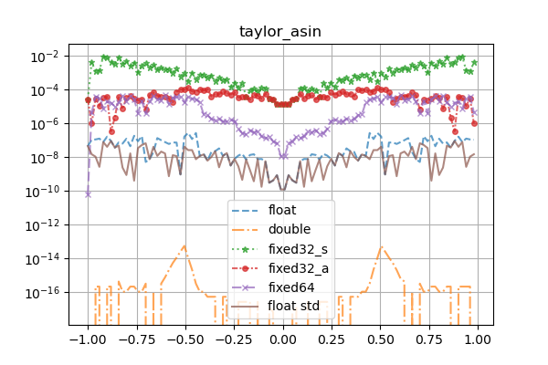 | 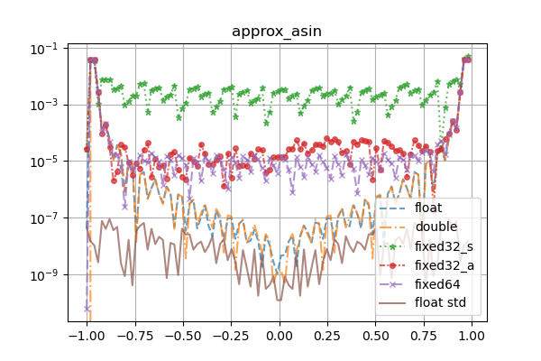
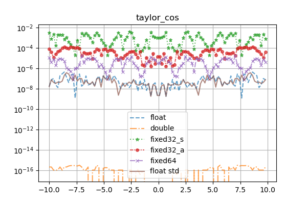 | 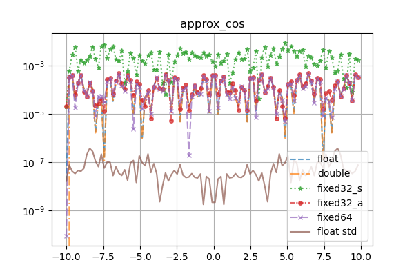
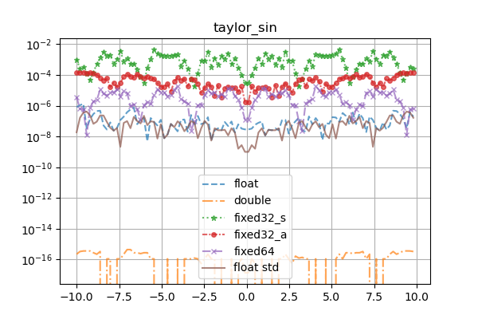 | 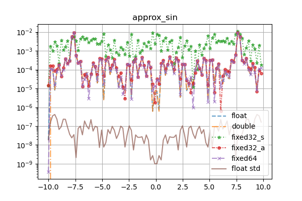
 | 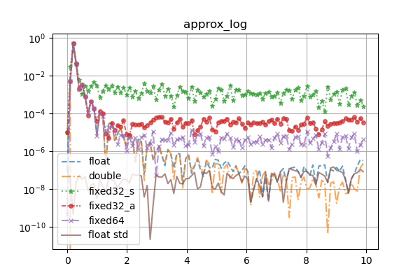
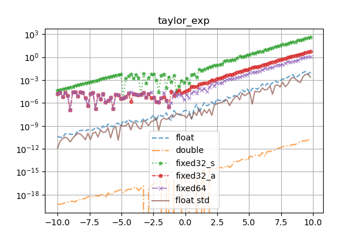 | 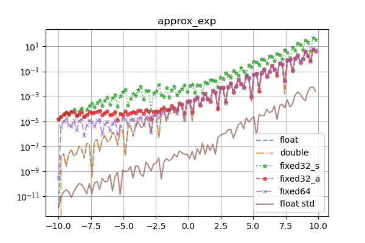
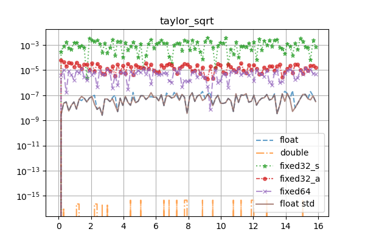 | 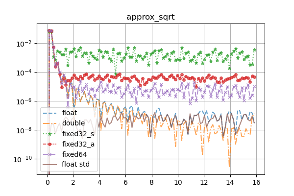

### Taylormath iterations 

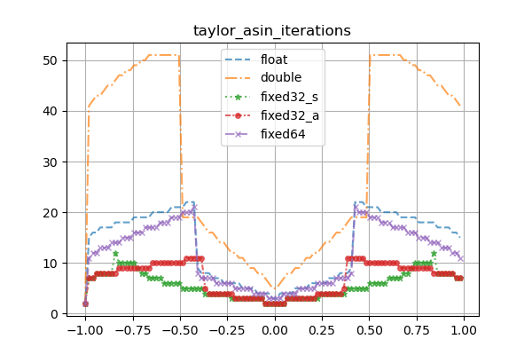
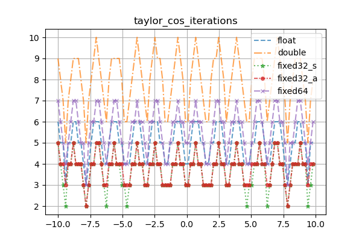
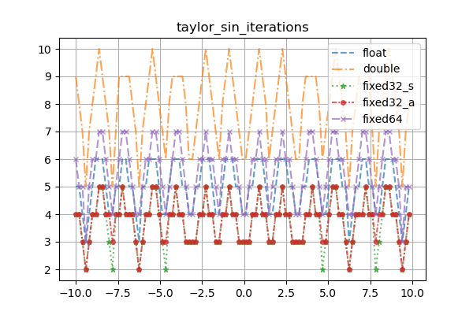
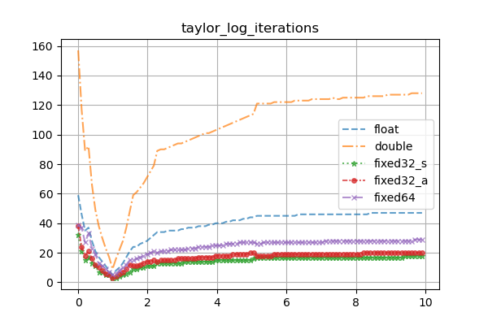
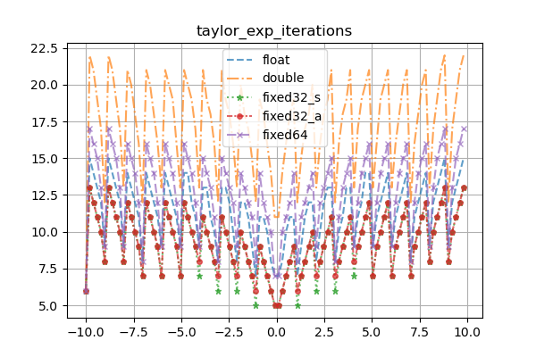
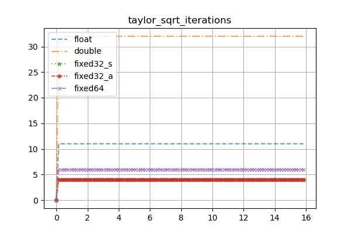

