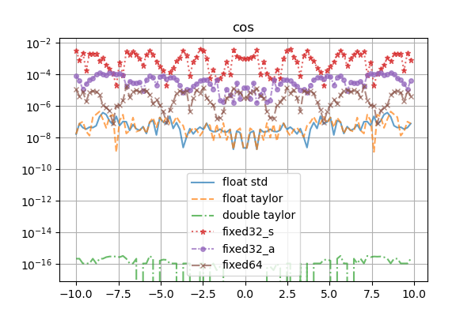
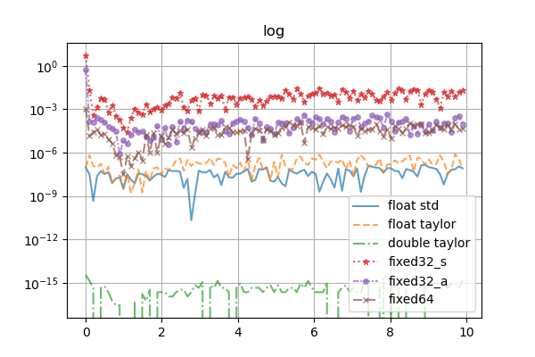

# Library for fixed point operations with math module based on (mostly) taylor series.

Template dedicated for RISC-V 32 IM.

## Usage

### Files

All library files can be found in `src/lib/`.
Just copy the files and include them. 
Additionally `taylormath` need to be linked with its `cpp` file.
 
The library works with C++:
* std-c++23
* std-c++20
* std-c++17
* std-c++11 if you are not going to use constexpr functionalities (they works but not everywhere)

### Usage in code

The template has the following prototype:
~~~
template<typename T, typename TC=typename make_fast_int<T>::type, unsigned frac_bits=sizeof(T)*4-1> class fixedpoint;
~~~

* `T` - integer type for calculations.
* `TC` - integer type for multiplication and division. By default it is `fast` type of the `T` (on 64-bits systems it is usually `int64` / `uint64`)
* `frac_bits` - number - where to put the fraction point.

There are predefinied types:

* Standard types (the fastest TC with at least T size)

    * signed

        * fixed8 - signed 8 bit `T`, fast 8 bit type for `TC`, 3 fraction bits
        * fixed16 - signed 16 bit `T`, fast 16 bit type for `TC`, 7 fraction bits
        * fixed32 - signed 32 bit `T`, fast 32 bit type for `TC`, 15 fraction bits
        * fixed64 - signed 64 bit `T`, fast 64 bit type for `TC`, 31 fraction bits

    * unsigned

        * ufixed8 - unsigned 8 bit `T`, fast 8 bit type for `TC`, 3 fraction bits
        * ufixed16 - unsigned 16 bit `T`, fast 16 bit type for `TC`, 7 fraction bits
        * ufixed32 - unsigned 32 bit `T`, fast 32 bit type for `TC`, 15 fraction bits
        * ufixed64 - unsigned 64 bit `T`, fast 64 bit type for `TC`, 31 fraction bits

* Accurate types (TC two times larger than T - except [u]int64)

    * signed

        * fixed8_a - signed 8 bit `T`, fast 16 bit type for `TC`, 3 fraction bits
        * fixed16_a - signed 16 bit `T`, fast 32 bit type for `TC`, 7 fraction bits
        * fixed32_a - signed 32 bit `T`, fast 64 bit type for `TC`, 15 fraction bits
        * *fixed64_a - signed 64 bit `T`, fast 64 bit type for `TC`, 31 fraction bits*

    * unsigned

        * ufixed8_a - unsigned 8 bit `T`, fast 16 bit type for `TC`, 3 fraction bits
        * ufixed16_a - unsigned 16 bit `T`, fast 32 bit type for `TC`, 7 fraction bits
        * ufixed32_a - unsigned 32 bit `T`, fast 64 bit type for `TC`, 15 fraction bits
        * *ufixed64_a - unsigned 64 bit `T`, fast 64 bit type for `TC`, 31 fraction bits*

* Simple types (same size of T and TC)

    * signed

        * fixed8_s - signed 8 bit `T`, 8 bit type for `TC`, 3 fraction bits
        * fixed16_s - signed 16 bit `T`, 16 bit type for `TC`, 7 fraction bits
        * fixed32_s - signed 32 bit `T`, 32 bit type for `TC`, 15 fraction bits
        * fixed64_s - signed 64 bit `T`, 64 bit type for `TC`, 31 fraction bits

    * unsigned

        * ufixed8_s - unsigned 8 bit `T`, 8 bit type for `TC`, 3 fraction bits
        * ufixed16_s - unsigned 16 bit `T`, 16 bit type for `TC`, 7 fraction bits
        * ufixed32_s - unsigned 32 bit `T`, 32 bit type for `TC`, 15 fraction bits
        * ufixed64_s - unsigned 64 bit `T`, 64 bit type for `TC`, 31 fraction bits

### Problem with operators

Due to possible inconsistency of result type on calculations of various fixedpoints both operands should be the same type. But it is not something that you must remember because the compiler will remind you. 
The solution is to use casting, f.e.: 
~~~
fixed32 x = 7.35;
fixed64 y = 21.37;
std::cout << x + (fixed32)y << std::endl;
std::cout << (fixed64)x + y << std::endl;
~~~

### Conversions from IEEE754
All conversions from floats works by multiplying float / double variable by some constant and then casting it to an integer type. It could be faster by using one of the following functions:

* from_ieee754
* from_float
* from_double

all of them might be faster or slower - it depends on the target platform. **Results of these functions could be also incorrect so always check results on the new target.** Although some assertions were made to avoid errors and thus in case of detection of an unsupported float/double format, these functions will use "standard" multiplication.

## Test results

### Speed comparision (microseconds per 100000 operations on ESP32C3@160MHz)

STARTING TESTS

<table><thead><tr><th>type</th><th>library</th><th>addition</th><th>subtraction</th><th>multiplication</th><th>division</th><th>sin</th><th>sqrt</th><th>asin</th><th>log</th><th>exp</th></tr></thead><tbody>
<tr><th>fixed32_s</th><th>taylormath</th><td>6984</td><td>6917</td><td>6299</td><td>48432</td><td>529823</td><td>88568</td><td>216561</td><td>377093</td><td>954940</td>

</tr>
<tr><th>fixed32_a</th><th>taylormath</th><td>6956</td><td>6923</td><td>15723</td><td>215729</td><td>663148</td><td>272583</td><td>259728</td><td>1409820</td><td>1054745</td>

</tr>
<tr><th>fixed64</th><th>taylormath</th><td>13258</td><td>13212</td><td>20760</td><td>240274</td><td>912275</td><td>384365</td><td>403477</td><td>2042292</td><td>1539105</td>

</tr>
<tr><th>float</th><th>cmath</th><td>101473</td><td>105846</td><td>164149</td><td>254711</td><td>2025271</td><td>344894</td><td>535366</td><td>1527870</td><td>2016058</td>

</tr>
<tr><th>double</th><th>cmath</th><td>118833</td><td>121308</td><td>289301</td><td>495254</td><td>3027948</td><td>615175</td><td>843388</td><td>2339807</td><td>2997101</td>

</tr>
<tr><th>float</th><th>taylormath</th><td>101470</td><td>105845</td><td>164147</td><td>254710</td><td>3190664</td><td>1834743</td><td>1586302</td><td>9610136</td><td>4867742</td>

</tr>
<tr><th>double</th><th>taylormath</th><td>118838</td><td>121306</td><td>289303</td><td>495248</td><td>6833728</td><td>8233115</td><td>8171410</td><td>37451224</td><td>11661239</td>

</tr>
</tbody></table>

 
Taylormath calculates until increasing accuracy is not possible, so the more accurate type, the more time is needed to calculate a function result.

### Taylormath accuracy 

Differences with double and cmath as reference. 

