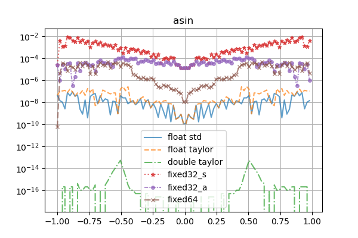

# Library for fixed point operations with math module based on (mostly) taylor series.

Template dedicated for RISC-V IM.

## Usage

### Files

All library files can be found in `src/lib/`.
Just copy the files and include them. 
Additionally `taylormath` need to be linked with its `cpp` file.

### Usage in code

The template has the following prototype:
~~~
template<typename T, typename TC=typename make_fast_int<T>::type, unsigned frac_bits=sizeof(T)*4-1>
~~~

* `T` - integer type for calculations.
* `TC` - integer type for multiplication and division. By default it is `fast` type of the `T` (on 64-bits systems it is usually `int64` / `uint64`)
* `frac_bits` - number - where to put the fraction point.

There are predefinied types:

* Standard types

    * signed

        * fixed8 - signed 8 bit `T`, fast 8 bit type for `TC`, 3 fraction bits
        * fixed16 - signed 16 bit `T`, fast 16 bit type for `TC`, 7 fraction bits
        * fixed32 - signed 32 bit `T`, fast 32 bit type for `TC`, 15 fraction bits
        * fixed64 - signed 64 bit `T`, fast 64 bit type for `TC`, 31 fraction bits

    * unsigned

        * ufixed8 - unsigned 8 bit `T`, fast 8 bit type for `TC`, 3 fraction bits
        * ufixed16 - unsigned 16 bit `T`, fast 16 bit type for `TC`, 7 fraction bits
        * ufixed32 - unsigned 32 bit `T`, fast 32 bit type for `TC`, 15 fraction bits
        * ufixed64 - unsigned 64 bit `T`, fast 64 bit type for `TC`, 31 fraction bits

* Accurate types

    * signed

        * fixed8_a - signed 8 bit `T`, fast 16 bit type for `TC`, 3 fraction bits
        * fixed16_a - signed 16 bit `T`, fast 32 bit type for `TC`, 7 fraction bits
        * fixed32_a - signed 32 bit `T`, fast 64 bit type for `TC`, 15 fraction bits
        * fixed64_a - signed 64 bit `T`, fast 64 bit type for `TC`, 31 fraction bits

    * unsigned

        * ufixed8_a - unsigned 8 bit `T`, fast 16 bit type for `TC`, 3 fraction bits
        * ufixed16_a - unsigned 16 bit `T`, fast 32 bit type for `TC`, 7 fraction bits
        * ufixed32_a - unsigned 32 bit `T`, fast 64 bit type for `TC`, 15 fraction bits
        * ufixed64_a - unsigned 64 bit `T`, fast 64 bit type for `TC`, 31 fraction bits

* Simple types

    * signed

        * fixed8 - signed 8 bit `T`, 8 bit type for `TC`, 3 fraction bits
        * fixed16 - signed 16 bit `T`, 16 bit type for `TC`, 7 fraction bits
        * fixed32 - signed 32 bit `T`, 32 bit type for `TC`, 15 fraction bits
        * fixed64 - signed 64 bit `T`, 64 bit type for `TC`, 31 fraction bits

    * unsigned

        * ufixed8 - unsigned 8 bit `T`, 8 bit type for `TC`, 3 fraction bits
        * ufixed16 - unsigned 16 bit `T`, 16 bit type for `TC`, 7 fraction bits
        * ufixed32 - unsigned 32 bit `T`, 32 bit type for `TC`, 15 fraction bits
        * ufixed64 - unsigned 64 bit `T`, 64 bit type for `TC`, 31 fraction bits

### Problem with operators

Due to possible inconsistency of result type on calculations of various fixedpoints both operands should be the same type. But it is not something that you must remember because the compiler will remind you. 
The solution is to use casting, f.e.: 
~~~
fixed32 x = 1;
fixed64 y = 2.98;
std::cout << x + (fixed32)y << std::endl;
std::cout << (fixed64)x + y << std::endl;
~~~

## Test results

### Speed comparision (microseconds per 100000 operations on ESP32C3@160MHz)

<table><thead><th><th>addition</th><th>subtraction</th><th>multiplication</th><th>division</th><th>sin</th><th>sqrt</th><th>asin</th><th>log</th><th>exp</th></tr></thead><tbody>
<tr><th>fixed32_s</th><td>6968</td><td>6915</td><td>6298</td><td>38997</td><td>210320</td><td>21003</td><td>106477</td><td>64946</td><td>303379</td>

</tr>
<tr><th>fixed32_a</th><td>6964</td><td>6922</td><td>15727</td><td>201890</td><td>317346</td><td>21247</td><td>113273</td><td>65423</td><td>391420</td>

</tr>
<tr><th>fixed64</th><td>13238</td><td>12586</td><td>21383</td><td>206306</td><td>874299</td><td>25047</td><td>300869</td><td>311184</td><td>1438529</td>

</tr>
<tr><th>float</th><td>101469</td><td>105844</td><td>163517</td><td>255333</td><td>2047593</td><td>347401</td><td>537889</td><td>1543884</td><td>2036340</td>

</tr>
<tr><th>double</th><td>118846</td><td>121312</td><td>288670</td><td>494615</td><td>3052356</td><td>627820</td><td>846884</td><td>2358328</td><td>3022996</td>

</tr>
</tbody></table>

Functions were computed using taylormath for fixed-point types and cmath for floating-point types

### Taylormath accuracy 

Differences with double and cmath as reference. 

